# Proje Bağlamı ve Genel Hedef
Bu proje, bir Elektrik-Elektronik Mühendisi için hazırlanmış profesyonel bir kişisel CV ve portfolyo web sitesinin yeniden tasarlanmasıdır.
Mevcut bir web sitesi zaten bulunmaktadır. **Mevcut sitedeki hiçbir bilgi, metin veya içerik (projeler, eğitimler, video linkleri) değiştirilmeyecektir.** 
Ana hedef; siteyi modern, profesyonel, güven veren ve teknolojik bir UI/UX tasarımına kavuşturmak, yeni temalar ve modern bileşenler (components) eklemektir.

# Tasarım ve Tema İlkeleri (UI/UX)
- **Profesyonellik ve Ciddiyet:** Mühendislik disiplinini yansıtan temiz, minimalist ve modern bir görünüm. Karmaşadan uzak durulmalıdır.
- **Renk Paleti:** Kurumsal ve güven veren tonlar tercih edilmelidir. Derin lacivert (Navy Blue), çelik grisi (Steel Grey) ana renkler; elektrik mavisi (Electric Blue) veya devre kartı yeşili (Circuit Green) gibi teknik çağrışımlar yapan renkler yalnızca "vurgu" (butonlar, hover efektleri, ikonlar) amacıyla kullanılmalıdır.
- **Karanlık Mod (Dark Mode):** Mühendislik ve yazılım dünyasında sıkça tercih edildiği için, sitenin kusursuz bir "Dark Mode" desteği olmalıdır.
- **Tipografi:** Okunabilirliği yüksek, modern sans-serif fontlar (örneğin: Inter, Roboto, veya SF Pro) kullanılmalıdır.
- **Görsel Çizgi:** Elektrik/Elektronik temasına uygun ince çizgiler, ızgara (grid) arka planlar veya çok hafif devre desenleri (background pattern) estetik bir şekilde, içeriği boğmadan kullanılabilir.

# İçerik Yapısı ve Gösterim Kuralları
Aşağıdaki içeriklerin sitede bulunduğu varsayılarak, bu bölümlerin tasarımsal olarak en iyi şekilde sergilenmesi sağlanmalıdır:
1. **Hakkımda / Profil:** Yetkinliklerin ve mühendislik vizyonunun net okunduğu, şık bir profil kartı veya kahraman (hero) alanı.
2. **Projeler ve Eğitim İçerikleri (Kritik Alan):**
   - Transformatörler, AC/DC motorlar ve RCD (Kaçak Akım Rölesi) çalışma prensipleri gibi teknik konular.
   - Arduino tabanlı motor kontrol projeleri ve donanım uygulamaları.
   - Elektrik faturası hesaplama araçları gibi pratik mühendislik çözümleri.
   *Tasarım Kuralı:* Bu projeler modern kart yapıları (card UI) ile sergilenmeli, teknik terimler şık etiketler (badge) ile vurgulanmalıdır.
3. **Medya / YouTube Entegrasyonu:** Eğitici teknik "YouTube Shorts" videolarının sitede dikey formata uygun, duyarlı (responsive) ve şık bir grid yapısı içinde listelenmesi sağlanmalıdır.
4. **İletişim:** Minimal ve fonksiyonel bir iletişim formu ve sosyal medya/GitHub/YouTube bağlantıları.

# Geliştirme ve Kodlama Standartları
- **İçerik Bütünlüğü:** `lorem ipsum` gibi sahte metinler üretilmeyecek, mevcut içerikler korunacaktır. Yeni bir bileşen tasarlandığında, mevcut veri yapısına uygun yer tutucular (placeholder) bırakılacaktır.
- **Responsive Tasarım:** Site, mobil cihazlardan (özellikle YouTube Shorts içeriklerinin mobilden izlenme oranı düşünülerek) geniş masaüstü ekranlara kadar her cihazda kusursuz görünmelidir. (Mobile-first yaklaşımı)
- **Animasyonlar:** CSS veya JS tabanlı animasyonlar (örn. sayfa geçişleri, kart hover efektleri) yumuşak ve abartısız olmalıdır. Sitenin hızını ve profesyonelliğini etkilememelidir.
- **Modülerlik:** Kodlar tekrar kullanılabilir bileşenler (components) halinde yazılmalı ve temiz kod (clean code) prensiplerine uyulmalıdır.

# Kesin Yasaklar
- Eğlence veya oyun sitelerini andıran çocuksu renkler ve aşırı hareketli, dikkat dağıtıcı animasyonlar kullanmak YASAKTIR.
- Mevcut kişisel bilgileri, proje detaylarını veya teknik açıklamaları yapay zeka inisiyatifiyle "iyileştirmek" veya değiştirmek YASAKTIR. Sadece kod ve tasarım iyileştirilecektir.

Güncel Sitenin kodları:

<!DOCTYPE html>
<html lang="tr">
<head>
  <meta charset="UTF-8" />
  <meta name="viewport" content="width=device-width, initial-scale=1" />
  <title>İsmail Kesmez | Electrical & Electronics Engineer</title>
  <meta name="description" content="İsmail Kesmez - Electrical & Electronics Engineer. Projects, skills and contact." />
  
  <link rel="icon" href="assets/images/profile-pic (1).png" type="image/png">

  <link rel="preconnect" href="https://fonts.googleapis.com">
  <link rel="preconnect" href="https://fonts.gstatic.com" crossorigin>
  <link href="https://fonts.googleapis.com/css2?family=Inter:wght@300;400;600;700;800;900&display=swap" rel="stylesheet">
  
</head>
<body>
  

  <header>
    <strong>İsmail Kesmez</strong>
    

      <nav>
        <a data-index="0" class="active" data-i18n="nav_home">Ana Sayfa</a>
        <a data-index="1" data-i18n="nav_about">Hakkımda</a>
        <a data-index="2" data-i18n="nav_skills">Yetenekler</a>
        <a data-index="3" data-i18n="nav_projects">Projeler</a>
        <a data-index="4" data-i18n="nav_certs">Sertifikalar</a>
        <a data-index="5" data-i18n="nav_contact">İletişim</a>
      </nav>
      

        
        
      

    

  </header>

  

    

      <section class="slide">
        

          <h1 data-i18n="title">Elektrik‑Elektronik Mühendisi</h1>
          
Elektrik-Elektronik Mühendisliği bölümünden yeni mezun oldum ve mühendislik alanında kendimi geliştirebileceğim, üretken bir ekip içinde yer alabileceğim bir pozisyon arıyorum. Üniversite sürecinde kablosuz enerji transferi, otomasyon ve güç elektroniği alanlarında projeler ve simülasyon çalışmaları yaptım. Öğrenmeye açık, disiplinli ve sorumluluk sahibi biriyim. Sahada ve ofis ortamında tecrübe kazanarak, teknik bilgi birikimimi gerçek projelere yansıtmayı ve çalıştığım kuruma değer katmayı hedefliyorum.

          

            STM32
            Arduino
            Güç Elektroniği
            Kontrol
            C/C++
          

          

            <a class="btn" href="mailto:ismailkesmez23@gmail.com" data-i18n="cta">İletişime Geç</a>
            <a class="btn" href="assets/documents/Ismail_Kesmez_CV.pdf" target="_blank" data-i18n="cta_cv">CV Görüntüle</a>
          

        

      </section>

      <section class="slide">
        

          <h2 data-i18n="about_title">Hakkımda</h2>
          
Elektrik-Elektronik Mühendisiyim ve kariyerimi belirli bir alanla sınırlamak yerine, ilerlemek istediğim yolu bilinçli şekilde inşa etmeyi hedefleyen bir mühendislik anlayışına sahibim. Gömülü sistemler, elektronik donanım ve sistem entegrasyonu başta olmak üzere; bir ürünün veya teknolojinin yalnızca tek bir parçasını değil, bütününü anlayabilen bir mühendis olmayı önemsiyorum. Bu nedenle, her alanda yüzeysel bilgi yerine; farklı disiplinlerde anlamlı ve birbiriyle bağlantılı bilgi birikimi oluşturmaya odaklanıyorum.

          
Mühendislik benim için durağan bir meslek değil, sürekli gelişim gerektiren dinamik bir süreçtir. Bu bakış açısıyla, her gün kendime yeni bir şey katmayı, teknik bilgimi güncel tutmayı ve öğrendiklerimi pratiğe dökmeyi temel prensip haline getirdim. Teknolojinin hızlı değiştiği günümüzde, yenilikleri kaçırmamak, yalnızca takip etmekle değil; bu yeniliklerin sistemler üzerindeki etkisini anlayabilmekle mümkündür. Bu yüzden hem teorik altyapımı güçlendirmeye hem de uygulamalı çalışmalarla bilgimi pekiştirmeye önem veriyorum.

          
Farklı sektörlerde ve projelerde karşılaşılabilecek değişken gereksinimlere hızlı adaptasyon sağlayabilmek, benim için teknik yetkinlik kadar değerlidir. Yeni bir teknolojiye, araca veya probleme yaklaşırken öğrenmeye açık olmak ve çözüm odaklı düşünmek, çalışma disiplinimin temelini oluşturur. Bilginin tek başına yeterli olmadığı; doğru yerde, doğru şekilde kullanılmasının fark yarattığına inanıyorum.

          
Uzun vadede hedefim; sürekli gelişen, değişen teknolojilere uyum sağlayabilen, farklı disiplinleri bir araya getirerek katma değer üreten ve ilerlediği yolu bilinçli şekilde şekillendiren bir mühendis olarak kariyerimi sürdürmektir.

        

      </section>

      <section class="slide skills-slide">
        

        

        
        

          <h2 data-i18n="skills_title">Yetenekler</h2>
          
          <h3 data-i18n="s1_t">Gömülü Sistemler (Embedded Systems)</h3>
          
Gömülü sistemler alanında, mikrodenetleyici tabanlı sistemlerin temel çalışma prensipleri üzerinde bilgi birikimimi geliştiriyorum. MCU mimarisi, çevresel birimler (peripheral), clock yapısı ve bellek organizasyonu gibi konularda teorik altyapıya sahibim. STM32 ekosistemi üzerinde; GPIO, timer, interrupt, ADC, UART ve I2C gibi temel modüllerin nasıl yapılandırıldığını ve sistem davranışını nasıl etkilediğini biliyorum. Gömülü yazılımın, donanımdan bağımsız düşünülemeyeceğinin farkındayım ve bu nedenle konfigürasyon, zamanlama ve deterministik davranış konularına özellikle önem veriyorum.

          <h3 data-i18n="s2_t">Elektronik ve Devre Bilgisi</h3>
          
Analog ve dijital elektronik temel prensiplerine hâkimim. Elektronik devrelerin çalışma mantığını yalnızca şema seviyesinde değil, sistem davranışı açısından da değerlendirebiliyorum. Güç besleme, inverter yapıları ve sinyal davranışı konularında temel bilgiye sahibim. Elektronik tasarımın; kararlılık, verim ve güvenilirlik kriterleriyle birlikte ele alınması gerektiğini biliyor, bu doğrultuda sistem seviyesinde düşünmeye çalışıyorum.

          <h3 data-i18n="s3_t">Güç Elektroniği ve Sistem Davranışı</h3>
          
Bitirme projem kapsamında inverter sistemleri, frekans–gerilim ilişkisi ve bu parametrelerin sistem davranışı üzerindeki etkileri üzerine çalıştım. Güç elektroniği uygulamalarında verim, ısınma ve kontrolün öneminin farkındayım. Bu alanda edindiğim bilgi, bana yalnızca devreyi değil, devrenin sistemi nasıl etkilediğini analiz etme yeteneği kazandırdı.

          <h3 data-i18n="s4_t">Öğrenme ve Adaptasyon Yeteneği</h3>
          
Yeni teknolojilere ve araçlara hızlı adapte olabilen bir yapıya sahibim. Her gün kendimi geliştirmeyi, öğrendiğim bilgileri pekiştirmeyi ve güncel kalmayı bir alışkanlık haline getirdim. Farklı disiplinlerde bilgi sahibi olmanın, mühendislikte daha doğru ve bütüncül kararlar almayı sağladığına inanıyorum.

          <h3 data-i18n="s5_t">Program Dilleri</h3>
          
<strong>C Dili:</strong> Arduino UNO ve Mega platformlarında gömülü sistem uygulamaları geliştirdim. Sensör okuma, motor kontrolü, röle tetikleme ve zamanlama tabanlı kontrol algoritmaları yazdım. Donanım-yazılım etkileşimi gerektiren projelerde aktif olarak kullandım.

          
<strong>C++ Dili:</strong> Arduino projelerinde modüler ve okunabilir kod yapıları oluşturdum. Kütüphane kullanımı, fonksiyonel ayrıştırma ve temel nesne tabanlı yapı ile mikrodenetleyici uygulamaları geliştirdim.

          
<strong>Python:</strong> OpenCV kütüphanesini kullanarak görüntü işleme uygulamalarında görev aldım. Bir projede hareket halindeki bir aracın plakasının drone görüntüsü üzerinden tespit ve takibini gerçekleştiren sistemin yazılımını inceledim.

          
<strong>PLC:</strong> Siemens TIA Portal ortamında Ladder Diagram kullanarak temel seviye PLC uygulamaları geliştirdim. Giriş-çıkış kontrolü, zamanlayıcılar ve basit otomasyon senaryoları üzerine çalışmalar yaptım.

        

      </section>

      <section class="slide">
        

          <h2 data-i18n="projects_title">Projeler</h2>
          
          <h3 data-i18n="p1_title">Kablosuz Enerji Aktarımlı Elektrikli Araç Şarj Yolu (Bitirme Projesi)</h3>
          
Bu projede, güneş enerjisi ile beslenen, kablosuz güç transferi kullanarak hareketli bir aracı şarj edebilen modüler bir yol sistemi tasarlanmış ve prototipi oluşturulmuştur.  Sistem; 20W 12V güneş paneli, 12V akü, 12V DC → 220V AC kare dalga inverter ve Arduino Uno kontrol ünitesinden oluşmaktadır. Yol boyunca yerleştirilmiş 16 adet U tipi ferrit çekirdekli verici bobin, IR sensörler yardımıyla aracın konumuna göre sadece aracın altında bulunan bobin aktif olacak şekilde kontrol edilmektedir. Bu sayede enerji israfı önlenmiş ve sistem verimliliği artırılmıştır.  Araç üzerinde ise iki adet alıcı bobin, doğrultma ve regülasyon devresi ile 8V 1.8Ah bataryanın şarj edilmesi sağlanmıştır. Araç, bu batarya ile çalışan Arduino, motor sürücü ve 4 adet 6V DC motor içermektedir.  Projede ayrıca 100 kHz çalışma frekansına uygun, UU6015 ferrit çekirdek üzerinde 20 tur verici bobin tasarımı yapılmış ve güç aktarımı deneysel olarak test edilmiştir.  <strong>Kazanımlar:</strong> • Güç elektroniği • Yüksek frekanslı inverter tasarımı • Kablosuz enerji transferi • Arduino ile gerçek zamanlı kontrol • Sensör tabanlı otomasyon

          <h3 data-i18n="p2_title">Güneş Enerjili Tarımsal Sulama Sistemi Tasarımı</h3>
          
Bu projede, 4 kW gücünde (İmpo SK 408/23) dalgıç pompayı besleyebilecek güneş enerjili bir sulama sisteminin boyutlandırması ve sistem tasarımı yapılmıştır. Hedef; 1 dönümlük tarım arazisi için günlük 5000–8000 litre su sağlayabilecek, günde 5–8 saat çalışabilen, şebekeden bağımsız (off-grid) bir sistem oluşturmaktır.  <strong>Sistem Kapsamı:</strong> • 6 kW güneş paneli gücü • Akü destekli enerji depolama yapısı • Uygun inverter seçimi • Günlük enerji tüketimi ve üretim hesabı • Pompa kalkış akımı ve sürekli çalışma gücü analizleri  <strong>Kazanımlar:</strong> • Yenilenebilir enerji sistemleri boyutlandırma • Yük analizi • İnverter ve akü kapasitesi hesaplama • Tarımsal enerji sistemleri planlama

          <h3 data-i18n="p3_title">Optimizasyon Tabanlı PID Kontrolcü Tasarımı (Akademik Çalışma)</h3>
          
Bu çalışmada, “Design of PID Controllers with Computational Optimization Approach” başlığı altında, klasik PID ayarlama yöntemleri yerine optimizasyon algoritmaları kullanılarak PID parametrelerinin belirlenmesi konusu incelenmiştir. Kontrol teorisi dersi kapsamında yapılan bu projede; PID kontrolcülerin çalışma prensipleri, manuel ayarlama yöntemlerinin dezavantajları ve optimizasyon tabanlı yaklaşımın performans iyileştirmesi teorik ve uygulamalı olarak ele alınmıştır.  Amaç; sistemin aşım (overshoot), yerleşme süresi (settling time) ve kararlı hal hatası (steady-state error) gibi performans kriterlerini iyileştiren PID parametrelerini hesaplamalı yöntemlerle elde etmektir.  <strong>Kazanımlar:</strong> • Kontrol sistemleri • PID optimizasyonu • Mühendislikte sayısal yöntemlerin kullanımı • Sistem performans analizi

          
        

      </section>

      <section class="slide">
        

          <h2 data-i18n="cert_title">Sertifikalar</h2>
          
Aldığım eğitimler ve kazandığım yetkinlik sertifikaları:

          
          

            
            

            <a class="cert-item" href="assets/certificates/Electric_Power_Systems.png" target="_blank">
              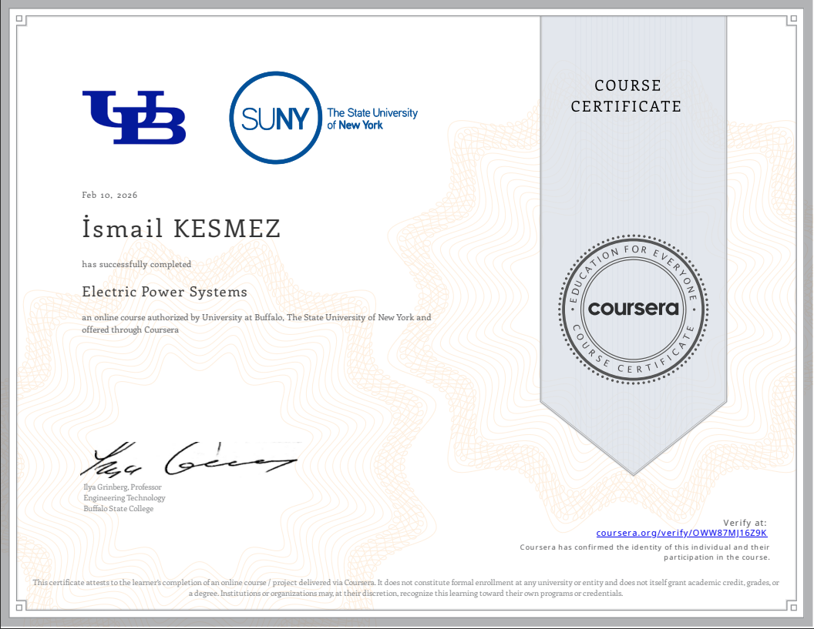
            </a>

            <a class="cert-item" href="assets/certificates/EmbeddedSystemUsingC.png" target="_blank">
              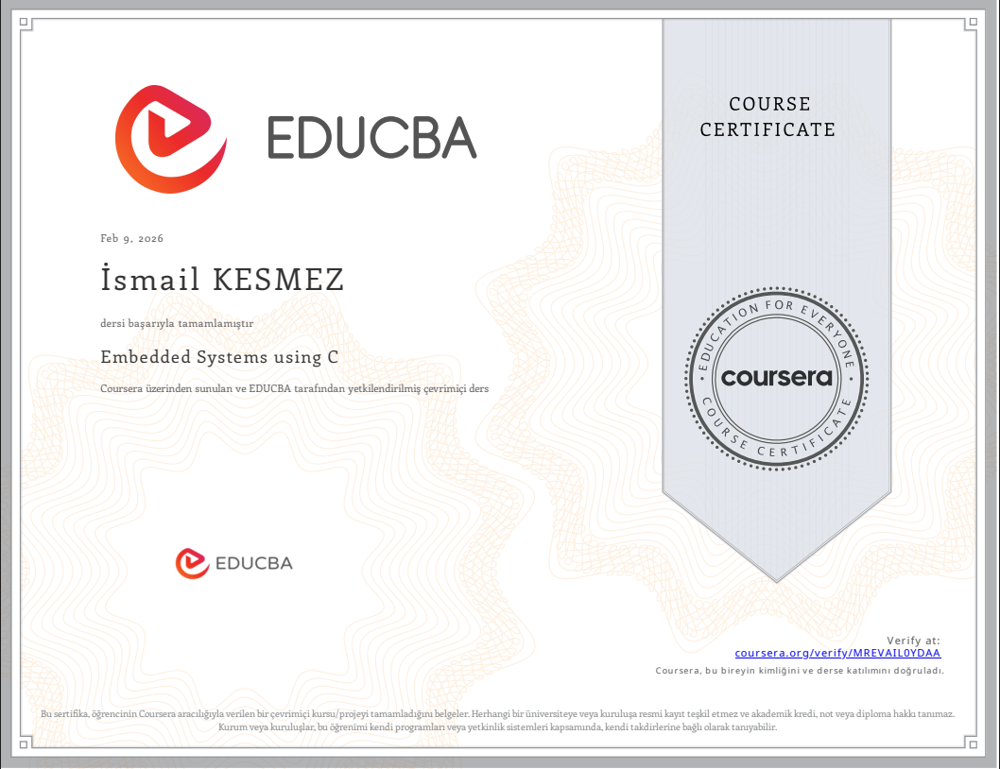
            </a>

            
            <a class="cert-item" href="assets/certificates/Güneş_enerji_sistemi_tasarımı_udemy.png" target="_blank">
              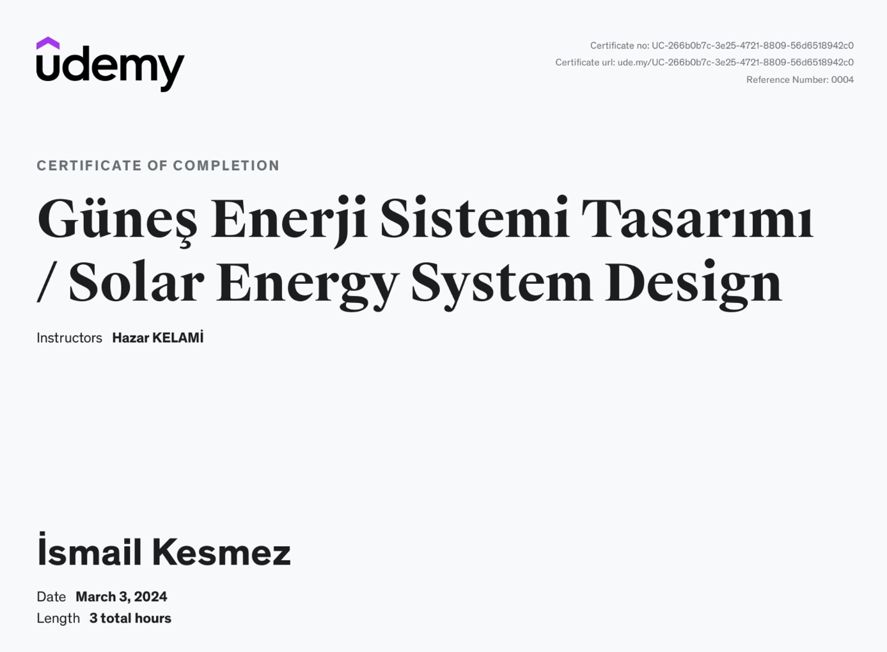
            </a>
            <a class="cert-item" href="assets/certificates/Temel_elektrik_elektronik_kursu_udemy.png" target="_blank">
              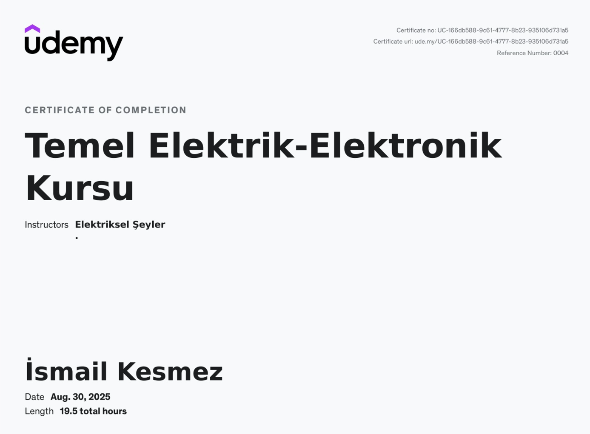
            </a>
            
            <a class="cert-item" href="assets/certificates/İş_analizi_nedir_linkedin.png" target="_blank">
              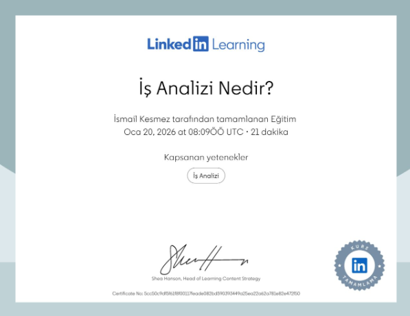
            </a>
            <a class="cert-item" href="assets/certificates/Üretken_yz_için_istem_mühendisliğine_giriş_Linkedin.png" target="_blank">
              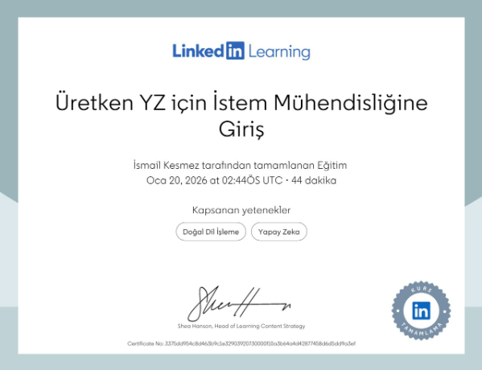
            </a>
            <a class="cert-item" href="assets/certificates/Üretken_yz_nedir_Linkedin.png" target="_blank">
              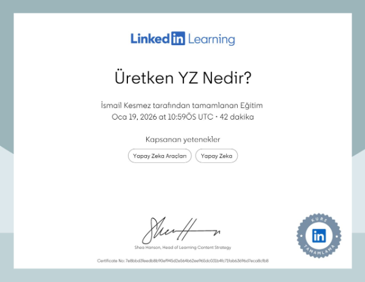
            </a>
            
            
            
            
            
            
            <a class="cert-item" href="assets/certificates/YZ_ve_sürdürülebilirliğe_giriş.png" target="_blank">
              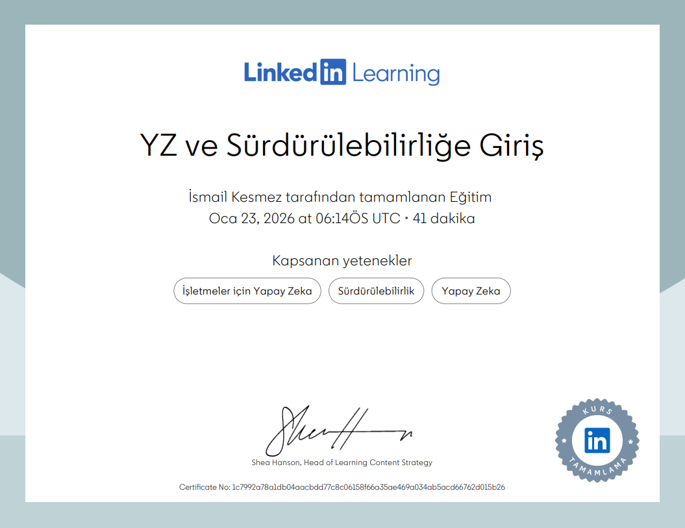
            </a>
            <a class="cert-item" href="assets/certificates/Siber_güvenlik_farkındalığı.png" target="_blank">
              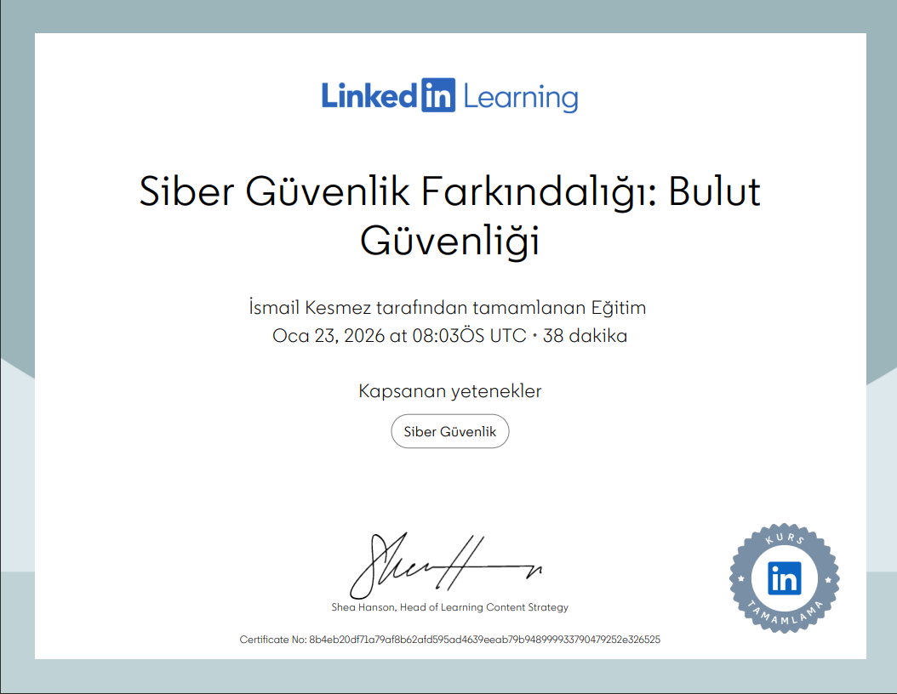
            </a>
            <a class="cert-item" href="assets/certificates/Linkedin_EkipleriYönetmek.png" target="_blank">
              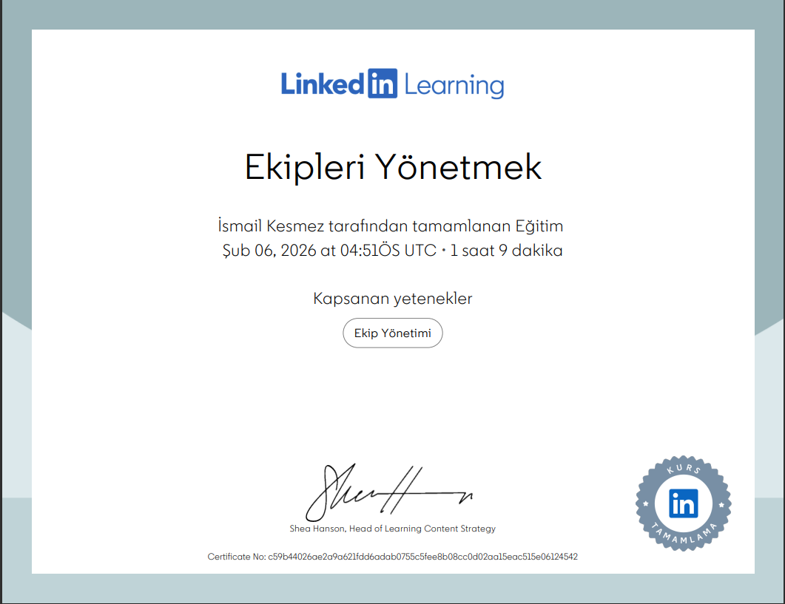
            </a>
            <a class="cert-item" href="assets/certificates/Yz.png" target="_blank">
              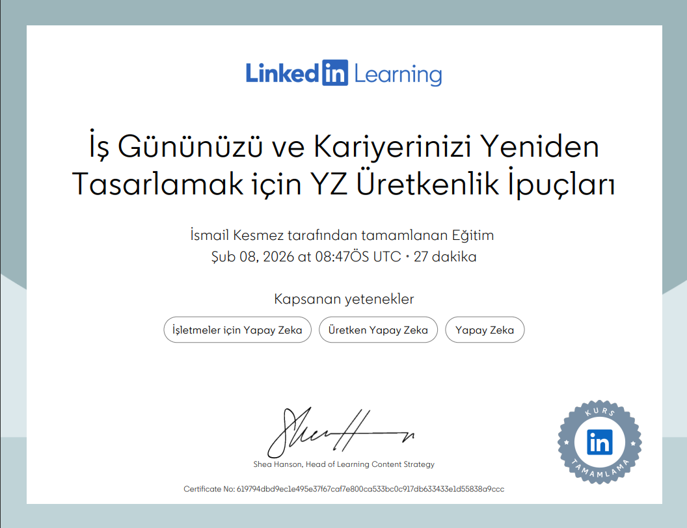
            </a>
            <a class="cert-item" href="assets/certificates/Pilotluk_sertifikası.png" target="_blank">
              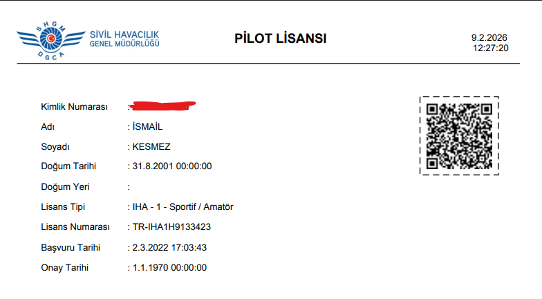
            </a>

            <a class="cert-item" href="assets/certificates/certificate-1771433506720.png" target="_blank">
              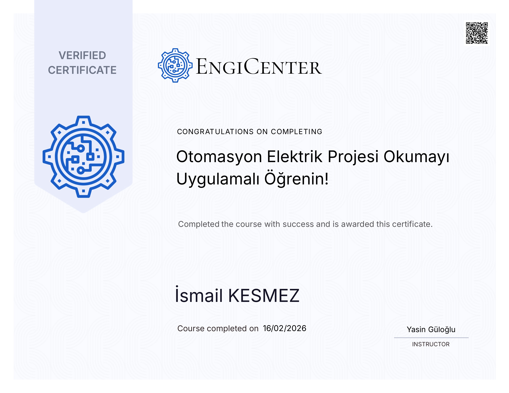
            </a>

            

          

        

      </section>

      <section class="slide">
        

          <h2 data-i18n="contact_title">İletişim</h2>

          

            <a class="contact-item" href="mailto:ismailkesmez23@gmail.com">
              
✉️

              

                E‑posta
                <strong>ismailkesmez23@gmail.com</strong>
              

            </a>

            <a class="contact-item" href="https://github.com/ismailkesmez" target="_blank">
              
🐙

              

                GitHub
                <strong>github.com/ismailkesmez</strong>
              

            </a>

            <a class="contact-item" href="https://www.linkedin.com/in/ismail-kesmez-4266a8234/" target="_blank">
              
💼

              

                LinkedIn
                <strong>linkedin.com/in/ismailkesmez</strong>
              

            </a>

            <a class="contact-item" href="https://www.youtube.com/@IsmailKesmez23" target="_blank">
              
📺

              

                YouTube
                <strong>youtube.com/@IsmailKesmez23</strong>
              

            </a>

          

        

      </section>

    

  

  <footer>©  İsmail Kesmez</footer>

  
</body>
</html>